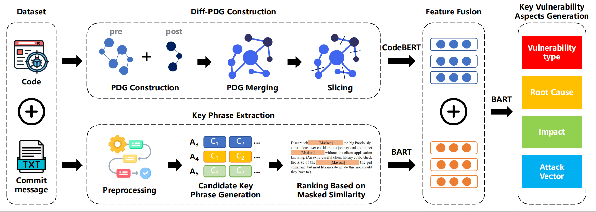

# VulPilot
Aspect-Level Explanation Generation for Vulnerability Understanding via Semantics-Aware Commit Representation Learning
## Abstract
Open Source Software (OSS) is now ubiquitous, but the inability to understand new vulnerabilities introduced by OSS poses significant risks. OSS updates are often applied silently, and these updates may introduce new vulnerabilities, particularly in dependent repositories (dependency updates). Third-party developers frequently fail to address these vulnerabilities promptly, leading to indirect, persistent, and potentially stealthy harm to downstream users. While prior studies have focused on detecting silent vulnerabilities, they often overlook a critical requirement: providing key vulnerability aspects to help third-party developers effectively mitigate risks.

To tackle the challenges of generating key vulnerability aspects, such as insufficient code context representation and noise in commit messages, we propose VulUnderstander, a framework for generating aspect-level explanations to aid in vulnerability understanding. Given the lack of explanation-focused datasets, we first manually constructed a dataset of key vulnerability aspects for explanation generation. Next, we construct diff-PDG and perform program slicing to extract a semantics-aware code context. For commit messages, we apply denoising by ranking key phrases based on mask similarity. Finally, we integrate features through an encoder-decoder model to generate explanations for four key vulnerability aspects. Experiments demonstrate that VulUnderstander achieves ROUGE-L improvements of 5.9% to 18.8% over state-of-the-art baselines. A user study further confirms that the generated explanations improve users' understanding of vulnerabilities.
## Overview

## Code Preprocessing
```
python preprocess/get_ab_file.py
python preprocess/gen_cpg.py
python preprocess/merge_pdg.py
```
## Commit Preprocessing
```
python key phrase extraction/preprocessing.py
python key phrase extraction/candidate.py
python key phrase extraction/rank.py
```
